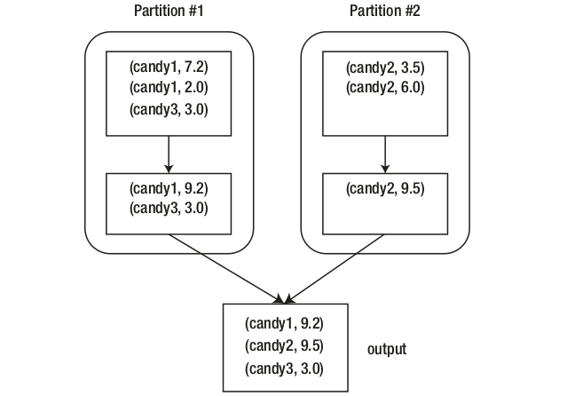

# Spark RDD Cheat Sheet

According to the seminal paper on Spark, RDDs are immutable, fault-tolerant, parallel data structures that let users explicitly persist intermediate results in memory, control their partitioning to optimize data placement, and manipulate them using a rich set of operators.

## RDD Operations

The RDD operations are classified into two types: Transformations and Actions. Transformation operations are lazily evaluated, meaning Spark will delay the evaluations of the invoked operations until an action is taken.

### Creating RDDs

- The first way to create an RDD is to parallelize an object collection, meaning converting it to a distributed dataset that can be operated in parallel.
The way to parallelize an object collection is to call the parallelize method of the
SparkContext class.
```
val stringList = Array("Spark is awesome","Spark is cool")
val stringRDD = spark.sparkContext.parallelize(stringList)
```
- The second way to create an RDD is to read a dataset from a storage system, which can be a local computer file system, HDFS, Cassandra, Amazon S3, and so on.
```
val fileRDD = spark.sparkContext.textFile("/tmp/data.txt")
```
-The third way to create an RDD is by invoking one of the transformation operations on an existing RDD.

### Transformations

#### map(func)
The most fundamental, versatile, and commonly used transformation is the map operation. It is used to transform some aspect of the data per row to something else.

- Using a Map Transformation to Convert All Characters in the String to Uppercase
```
val allCapsRDD = stringRDD.map(line => line.toUpperCase)
allCapsRDD.collect().foreach(println)
```
- Defining a Function and Using It in the Map Transformation
```
def toUpperCase(line:String) : String = {  line.toUpperCase }
stringRDD.map(l => toUpperCase(l)).collect.foreach(println)
```
- Using a map Transformation to Convert Text Data into Scala Contact Objects
```
case class Contact(id:Long, name:String, email:String)
val contactData = Array("1#John Doe#jdoe@domain.com","2#Mary
Jane#mjane@domain.com")
val contactDataRDD = spark.sparkContext.parallelize(contactData)
val contactRDD = contactDataRDD.map(l => {
         val contactArray = l.split("#")
         Contact(contactArray(0).toLong, contactArray(1), contactArray(2))
})
contactRDD.collect.foreach(println)
```
#### flatMap(func)
The second most commonly used transformation is flatMap. Let’s say you want to transform the stringRDD from a collection of strings to a collection of words. The flatMap transformation is perfect for this use case.
- Using the flatMap Transformation to Transform Lines into Words
```
val wordRDD = stringRDD.flatMap(line => line.split(" "))
wordRDD.collect().foreach(println)
```
It is extremely important to have a clear understanding of the behavior differences between the map and flatMap transformations.
- The Behavior of map vs. flatMap
```
stringRDD.map(line => line.split(" ")).collect
-> Array[Array[String]] = Array(Array(Spark, is, awesome), Array(Spark, is, cool))
```
```
stringRDD.flatMap(line => line.split(" ")).collect
-> Array[Array[String]] = Array(Array(Spark, is, awesome), Array(Spark, is, cool))
```
#### filter(func)
Another commonly used transformation is the filter transformation. It does what its name sounds like, which is to filter a dataset down to the rows that meet the conditions defined inside the given func.
- Filtering for Lines That Contain the Word Awesome
```
val awesomeLineRDD = stringRDD.filter(line => line.contains("awesome"))
awesomeLineRDD.collect
```
#### mapPartitions(func)/mapPartitionsWithIndex(index, func)
To complete
- Performing a Setup Before Performing a Transformation on Each Row
```
import scala.util.Random
val sampleList = Array("One", "Two", "Three", "Four","Five")
val sampleRDD = spark.sparkContext.parallelize(sampleList, 2)
val result = sampleRDD.mapPartitions((itr:Iterator[String]) => {
		val rand = new Random(System.currentTimeMillis +
		Random.nextInt)
               itr.map(l => l + ":" + rand.nextInt)
           }
result.collect()
```
#### union(otherRDD)
Unlike previous transformations that take a function as an argument, a union transformation takes another RDD as an argument, and it will return an RDD that combines the rows from both RDDs. This is useful for situations when there is a need to append some rows to an existing RDD. This transformation does not remove duplicate rows of the resulting RDD.

- Combining Rows from Two RDDs
```
val rdd1 = spark.sparkContext.parallelize(Array(1,2,3,4,5))
val rdd2 = spark.sparkContext.parallelize(Array(1,6,7,8))
val rdd3 = rdd1.union(rdd2)
rdd3.collect()
```
#### intersection(otherRDD)
If there were two RDDs and there is a need to find out which rows exist in both of them, then this is the right transformation to use. The way this transformation figures out which rows exist in both RDDs is by comparing their hash codes. This transformation guarantees the returned RDD will not contain any duplicate rows. Unlike the map and filter transformations, the implementation of this transformation moves rows with the same hash code to the same executor to perform the intersection.

- Performing an Intersection of Two RDDs
```
val rdd1 = spark.sparkContext.parallelize(Array("One", "Two", "Three"))
val rdd2 = spark.sparkContext.parallelize(Array("two","One","threed","One"))
val rdd3 = rdd1.intersection(rdd2)
rdd3.collect()
```
#### substract(otherRDD)
A good use case for this transformation is when there is a need to compute the statistics of word usage in a certain book or a set of speeches. A typical first task in this process is to remove the stop words, which refers to a set of commonly used words in a language. In the English language, examples of stop words are is, it, the, and and. So, if you have one RDD that contains all the words in a book and another RDD that contains just the list of stop words, then subtracting the first one from the second one will yield another RDD that contains only nonstop words.
```
val words = spark.sparkContext.parallelize(List("The amazing thing about
spark is that it is very simple to learn")).flatMap(l => l.split(" ")).
map(w => w.toLowerCase)
val stopWords = spark.sparkContext.parallelize(List("the it is to that")).
flatMap(l => l.split(" "))
val realWords = words.substract(stopWords)
realWords.collect()
```
#### distinct( )
The distinct transformation represents another flavor of transformation where it doesn’t take any function or another RDD as an input parameter. Instead, it is a directive to the source RDD to remove any duplicate rows. The question is, how does it determine whether two rows are the same? A common approach is to transpose the content of each row into a numeric value by computing the hash code of the content. That is exactly what Spark does. To remove duplicate rows in an RDD, it simply computes the hash code of each row and compares them to determine whether two rows are identical.

- Removing Duplicates Using the distinct Transformation
```
val duplicateValueRDD = spark.sparkContext.parallelize(List("one", 1, "two", 2, "three", "one", "two", 1, 2)
duplicateValueRDD.distinct().collect
```
#### sample(withReplacement, fraction, seed)

Sampling is a common technique used in statistical analysis or machine learning to either reduce a large dataset to a more manageable size or to split the input dataset into a training set and a validation set when training a machine learning model.

- Sampling with Replacement
```
val numbers =  spark.sparkContext.parallelize(List(1,2,3,4,5,6,7,8,9,10), 2)
numbers.sample(true, 0.3).collect
```
### Actions

#### collect( )
This is a fairly easy-to-understand action because it does exactly what it sounds like. It collects all the rows from each of the partitions in an RDD and brings them over to the driver program.

- Using the collect Action to See the Rows in the Small RDD
```
val numberRDD =  spark.sparkContext.parallelize(List(1,2,3,4,5,6,7,8,9,10), 2)
numberRDD.collect()
```
#### count( )
Similar to the collect action, this action does exactly what it sounds like. It returns the
number of rows in an RDD by getting the count from all partitions and finally sums them up.

- Counting the Number of Rows in an RDD
```
val numberRDD =  spark.sparkContext.parallelize(List(1,2,3,4,5,6,7,8,9,10), 2)
numberRDD.count()
```
#### first()
This action returns the first row in an RDD. Now you may be wondering, what does the first row mean? Is there any ordering involved? It turns out it literally means the first row in the first partition. However, be careful about calling this action if your RDD is empty.
In that case, this action will throw an exception.
- Getting the First row in an RDD
```
val numberRDD =  spark.sparkContext.parallelize(List(1,2,3,4,5,6,7,8,9,10), 2)
numberRDD.first()
```
#### take(n)
This action returns the first n rows in the RDD by collecting rows from the first partition and then moves to the next partition until the number of rows matches n or the last partition is reached. If n is larger than the number of rows in the dataset, then it will return all the rows. take(1) is equivalent to the first() action.

- Getting the First six rows in an RDD
```
val numberRDD =  spark.sparkContext.parallelize(List(1,2,3,4,5,6,7,8,9,10), 2)
numberRDD.take(6)
```
#### reduce(func)
Compared to other actions, this one is pretty different. It reduces all the rows in the dataset to a single value using the provided function. A common use case is to perform
a sum of all the integers in the dataset. There are two rules that the provided functions
must follow. The first one is it must be a binary operator, meaning it must take two
arguments of the same type, and it produces an output of the same type. The second one
is it must follow the commutative and associative properties in order for the result to be
computed correctly in a parallel manner.
```
val numberRDD =  spark.sparkContext.parallelize(List(1,2,3,4,5,6,7,8,9,10), 2)

def add(v1:Int, v2:Int) : Int = {
      println(s"v1: $v1, v2: $v2 => (${v1 + v2})")
      v1 + v2
}

numberRDD.reduce(add)
```
#### takeSample(withReplacement, n, [seed])
The behavior of this action is similar to the behavior of the sample transformation. The
main difference is this action returns an array of sampled rows to the driver program.
The same caution for the collect action is applicable here in terms of the large number
of returned rows.

#### takeOrdered(n, [ordering])
This action returns n rows in a certain order. The default ordering for this action is the
natural ordering. If the rows are integers, then the default ordering is ascending. If you
need to return n rows with the values in descending order, then you specify the reverse
ordering.
- Examples of the takeOrdered Action with Ascending and Descending Order
```
val numberRDD =  spark.sparkContext.parallelize(List(1,2,3,4,5,6,7,8,9,10), 2)
numberRDD.takeOrdered(4)
numberRDD.takeOrdered(4)(Ordering[Int].reverse)
```
#### top(n, [ordering])
A good use case for using this action is for figure out the top k (largest) rows in an RDD as defined by the implicit ordering. This action does the opposite of the takeOrdered action.
- Using the top Action
```
val numberRDD =  spark.sparkContext.parallelize(List(1,2,3,4,5,6,7,8,9,10), 2)
numberRDD.top(4)
```
#### saveAsTextFile(path)
Unlike previous actions, this one does not return anything to the driver program.
Instead, it will write out each row in the RDD as a string to the specified path. If an RDD has five partitions, the saveAsTextFile action will write out the rows in each partition in its own file; therefore, there will be five part files in the specified path. Notice that this action takes a path name rather than a file name, and it will fail if the specified path already exists. The intention for this behavior is to prevent the accidental overwriting of existing data.

#### Creating Key/Value Pair RDD
In Scala, the simplest way to create a pair RDD is to arrange the data of each row into
two parts: key and value. Then use the built-in Scala class called Tuple2, which is a
shorthand version of using parentheses.
```
val rdd = sc.parallelize(List("Spark","is","an", "amazing", "piece", "of","technology"))
val pairRDD = rdd.map(w => (w.length,w))
pairRDD.collect().foreach(println)
```
### Key/Value Pair RDD Transformations
In addition to the transformations a key/value pair RDD has additional transformations that are designed to operate on keys.

#### groupByKey([numTasks])
This transformation does exactly what it sounds like. It will group all the rows with the
same key into a single row. Essentially the number of rows in the returned RDD will be
the same as the number of unique keys in the parent RDD. Each row in the returned
RDD contains a unique key and a list of values of that same key.
- Using the groupByKey Transformation to Group Words by Their
Length
```
val rdd = sc.parallelize(List("Spark","is","an", "amazing", "piece",
"of","technology"))
val pairRDD = rdd.map(w => (w.length,w))
val wordByLenRDD = pairRDD.groupByKey()
wordByLenRDD.collect().foreach(println)
```
#### reduceByKey(func, [numTasks])
This transformation is often used to reduce all the values of the same key to a single
value. The process is carried out in two steps, as depicted in Figure below. The first one
is to group the values of the same key together, and the second step is to apply the
given reduce function to the list of values of each key. The implementation of this
transformation contains a built-in optimization to perform this two-step process at two
levels. The first level is at each individual partition, and the second level is across all the partitions. By applying this transformation at each individual partition first, it therefore collapses all the rows with the same key in the same partition to a single row, and as a result, the amount of data that needs to be moved across many partitions is dramatically reduced.




